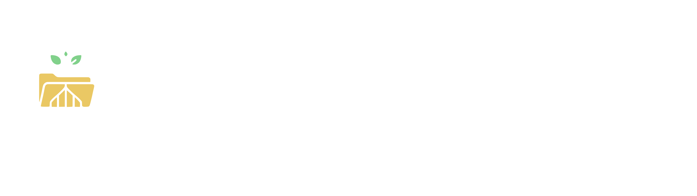

<div align="center">




[](https://www.npmjs.com/package/@cafeine-software/abuseipdb)

[Introduction](#Introduction) • [Features](#Features) [Installation](#Installation) • [Usage](#Usage) • [License](#License) • [Contact](#Contact) • [Links](#Links) • [Support](#support)

<br/>
</div>

# Presentation
Simple and efficient way to create a complete filetree in one function. I created it to simplify the build process of my own framework (i know this information about my life is not usefull xD)

# Features : 
- Create the folders structure
- Create files
- Copy file
- Copy all files from a folder and subfolder

# Installation
```bash
npm i @cafeine-software/arboCrafter
```

# Usage

```javascript
import { buildFileTree } from '@cafeine-software/arboCrafter';

// ⬇ Define the structure of the filetree you want to create
const fileTreeStructure = {}

// ⬇ Where to create the filetree
const outputFolder = "out"

// ⬇ Will do nothing , look at example bellow :)
buildFileTree(fileTreeStructure,outputFolder)
```

## Folder creation
Any object in the file tree structure definition will be considered as folder

```javascript
const fileTreeStructure = {
    folder1: {}
}

buildFileTree(fileTreeStructure,outputFolder)

// Result : 
// - Create a folder 'folder1'
```

## File creation

```javascript
const fileTreeStructure = {
    folder1:{
        'example.txt':'example content'
    }
}

buildFileTree(fileTreeStructure,outputFolder)

// Result :
// - Create a folder 'folder1'
// - Create a file 'example.txt' with content 'example content'
```

## File Copy

```javascript
const fileTreeStructure = {
    folder1:{
        'example.txt':'example content',
        '.gitignore.copy': `@.gitignore`,
    }
}

buildFileTree(fileTreeStructure,outputFolder)

// Result :
// - Create a folder 'folder1'
// - Create a file 'example.txt' with content 'example content'
// - Copy file '.gitignore' as '.gitignore.copy'
```

## Folder Files Copy

Will copy all files from source folder but not the structure

```javascript
const fileTreeStructure = {
    folder1:{
        'example.txt':'example content',
        '.gitignore.copy': `@.gitignore`,
    },
    folderCopy:"@../../srcFolderPath"
}

buildFileTree(fileTreeStructure,outputFolder)

// Result :
// - Create a folder 'folder1'
// - Create a file 'example.txt' with content 'example content'
// - Copy file '.gitignore' as '.gitignore.copy'
// - Copy all files from folder '../../srcFolderPath' in 'folderCopy'
```

# License
[](https://creativecommons.org/licenses/by-nc-sa/4.0)


# Contact
Developed by **Quentin Lamamy**, contact me on Linked In

# Links
[](https://www.linkedin.com/in/quentin-lamamy/)
[](github.com/quentin-lamamy)
[](github.com/Cafeine-Software)

# Support
<a href="https://www.buymeacoffee.com/quentinlamamy"></a>